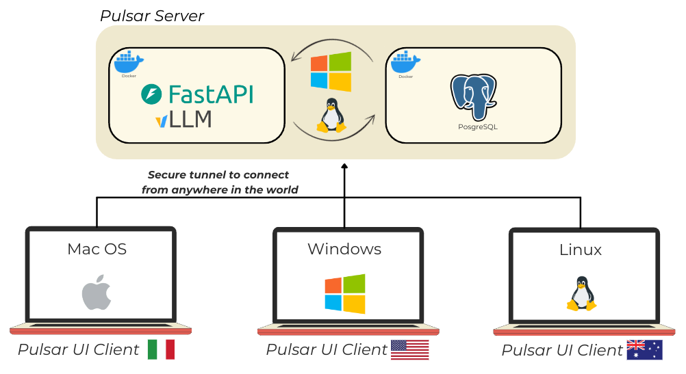

<h1>
  
  Pulsar AI 🌟: Your Local, Sharable AI Powerhouse
</h1>

## Table of Contents
- [Introduction](#introduction)
- [Our Vision](#our-vision)
- [Key Features](#key-features)
- [Registration](#registration)
- [Installation](#installation)
- [Getting Started](#getting-started)
- [Current State and Roadmap](#current-state-and-roadmap)
- [Contributing](#contributing)
- [Support](#support)
- [Acknowledgments](Acknowledgments)

## Welcome to Pulsar AI 🚀 

The Pulsar project originated from our desire to have a system that was easy to use, easy to share, and that worked completely locally with language models (LLMs). Initially, we developed Pulsar solely as a user interface to use the models in streaming mode. However, as the project progressed and new features and trends were identified, we expanded its functionality to include features such as roleplaying, support for multimodal models, and soon RAG.

## Introduction

Pulsar is a new system developed by Astramind, primarily designed to perform inference and interact with LLM models in a simple, fast, and local manner. Within Pulsar, users can access all text generation models available on Hugging Face. The model library is updated daily to ensure that everyone can find their preferred models. If a specific model is not available, users can manually upload their own models into Pulsar through the UI. Additionally, each model can be specialized by adding a LoRA (automatic compatibility checking) or by incorporating a personality chosen from the Pulsar library. If a desired personality is not available, users can create their own, allowing their models to communicate in a unique way.

Pulsar is totally free for private individuals and for companies up to one million in revenue. This is precisely why it is designed with a postgresql-based database management architecture and a backend using vllm as the engine, to make it robust for all uses.

1. **Local Processing**: Unlike cloud-based solutions, Pulsar runs entirely on your machine, ensuring data privacy.
2. **Compatibility**: Compatible with all vllm models.
3. **Efficiency**: Optimized for local hardware, during the installation we set the best model for your computational resource.
4. **Backend**: All the backend is open and can be customizable.
5. **Tunneling**: Use of tunneling to connect devices in a secure way.
6. **vLLM**: Pulsar leverages vLLM as its main engine, enhancing it with automatic model compatibility verification, error interception, and resilient configurations to ensure efficient and reliable inference of LLM models.
7. **Concurrent Batch Processing**: By processing multiple batch tasks concurrently, the system efficiently handles requests from various users simultaneously.

## Our Vision

We believe that AI should be a tool that anyone can use, right on their own computer, without relying on external services. Pulsar is our attempt to make this vision a reality.
Created by two passionate programmers, this project aims to push the boundaries of AI usability and bring powerful AI capabilities to your local environment.

## Key Features

1. **Local AI Processing** 🏠
   - Local storage and management of LLM models and associated data
   - Eliminates dependency on external cloud services for computations

2. **Asynchronous Batch API** ⚡
   - Efficient handling of large-scale batch processing requests powered by the high-performance vLLM engine

3. **Character-based Chat System** 💬
   - Engaging chat interface with customizable AI characters, perfect for Role Play

4. **Pulsar Boost: Advanced Search and Decision Making** 🔍
   - Implementation of R-Star algorithm for efficient spatial indexing
   - Integration of Monte Carlo Tree Search (MCTS) for enhanced decision-making processes

5. **Multi-User and Message Version Control** 👥
   - Separate user environments with message versioning
   - Facilitates collaboration and tracking of interactions

6. **Multimodal Model Support** 🖼️
   - Compatibility with all vLLM models, including text and image

7. **OpenAI-Compatible API** 🔗
   - Maintains API compatibility with OpenAI standards
   - Ensures easy integration with existing systems and workflows that are using the OpenAI protocol

8. **Auto-Update Mechanism** 🔄
   - Automated updates of the Pulsar system

9. **Intelligent Model Selection** 🧠
   - Automated first model selection based on user computational resources
   - Continuous evaluation and optimization of model choices for best performance

10. **Automated Tunneling System** 🌐
    - Automatic establishment of tunnels for remote access and management
    - Avoids complicated DNS or DMZ configurations, allowing users to simply and freely use tunneling

11. **System Compatibility Checks** ✅
    - Automated verification of LoRA (Low-Rank Adaptation) compatibility with models regardless of quantizations

12. **Auto-Model Addition** 🔍
    - Automated discovery and integration of new models and LoRA weights from HuggingFace
    - Daily up-to-date with the latest models

## Registration
Necessity of registration. This is because registration associates a pair of public and private keys. The machine designated as the server stores the private key and generates encrypted requests to our server, which, by verifying the signature, attests to the validity of the request and associates the new URL with the account. This process is completely free and avoids complicated DNS or DMZ configurations, allowing users to simply and freely use tunneling. 
**Everything is done to make it possible for the user to connect in a secure way with the local server. We do not keep any additional information of the user. Data users are not our business!!** 

## Installation

### Linux
Easy way: you can use our installation script in installer/installer.sh. 
Download the file in a and then run `sudo chmod +x installer.sh` and then `bash installer.sh`

### Detailed instructions

Pulsar AI offers flexible installation options to suit different user needs and environments.
For detailed, step-by-step installation instructions, please refer to our gudes:
**[Linux Installation Guide](https://github.com/astramind-ai/Pulsar/blob/main/docs/installation-linux.md)** | **[Windows Installation Guide](https://github.com/astramind-ai/Pulsar/blob/main/docs/installation-windows.md)**

## Getting Started

After installation, you can launch the **[Pulsar UI](https://github.com/astramind-ai/PulsarUIReleases)**
Here are some quick steps to get you started:

1. **Set your computer as a server**: [Tutorial]()
2. **Choose or Create a Models**: [Tutorial]()
3. **Choose or Create a Personality**: [Tutorial](tutorial/Choose_or_Create_a_Personality.md)
4. **Start chatting and explore advance settings**: [Tutorial](tutorial/Chatting_and_advance_setting.md)

## Current State and Roadmap

As a v0.1.0 release, Pulsar is still in its early stages. It may have rough edges, and there's a lot we want to improve. But we're excited to share our progress and learn from the community.

### Future Roadmap

- [ ] Adding text-to-speech
- [ ] Adding RAG
- [ ] Enhanced support for distributed computing environments
- [ ] Improved user interface and experience
      

## Contributing

We welcome contributions from the community! Whether it's bug reports, feature requests, or code contributions, your input is valuable. 

## Support

If you encounter any issues or have questions, please:

1. Search existing [Issues](https://github.com/astramind-ai/Pulsar/issues)
2. Open a new issue if needed

## Acknowledgments

Special thanks to:

- [vLLM](https://github.com/vllm-project/vllm)
- [HuggingFace](https://github.com/huggingface)
- [PostgreSQL](https://www.postgresql.org)
- [FastAPI](https://github.com/fastapi/fastapi)

---

Thank you for your interest in Pulsar. We're just two programmers with a big dream, and we're grateful for every user who joins us on this journey. Together, let's make AI more accessible and powerful for everyone! 🌟
