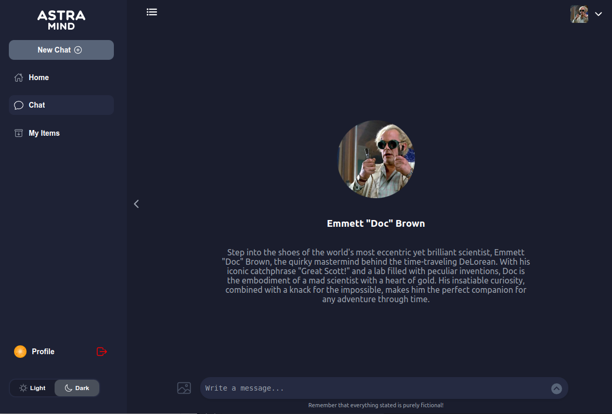
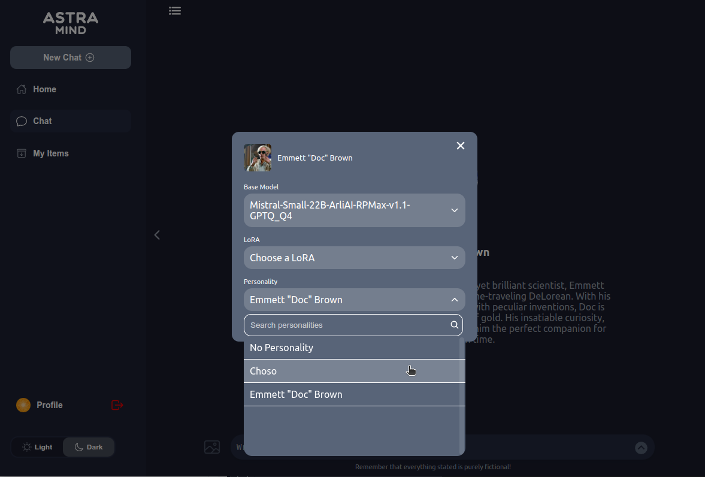
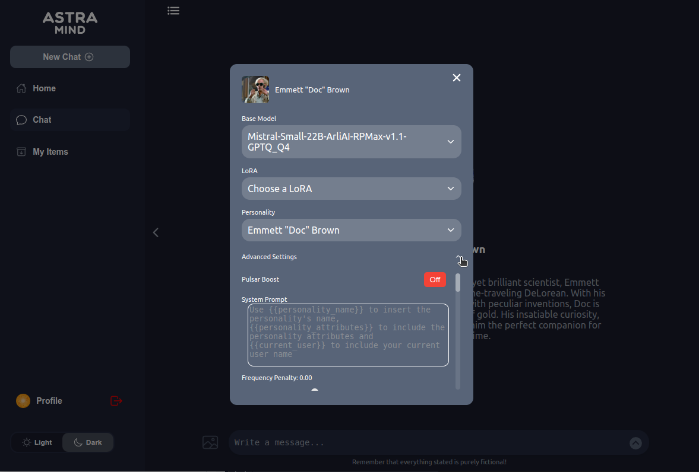

# Configure Chat Settings

*This guide provides an overview of how to configure chat settings. By following these steps, you can customize the model, add LoRA, personalities and set advanced settings to optimize performance.*

## Table of Contents

1. [Step 1: Select or Change the Model](#step-1-select-or-change-the-model)
2. [Step 2: Configure LoRA (OPTIONAL)](#step-2-configure-lora-personality-optional)
3. [Step 3: Configure Personality (OPTIONAL)](#step-3-configure-lora-personality-optional)

4. [Step 4: Adjust Advanced Settings (OPTIONAL)](#step-4-adjust-advanced-settings-optional)
   - [Pulsar Boost](#pulsar-boost)
   - [Number of Rollouts](#number-of-rollouts)
   - [Max Depth](#max-depth)
   - [System Prompt](#system-prompt)
   - [Frequency Penalty](#frequency-penalty)
   - [Logit Bias](#logit-bias)
   - [Logprobs](#logprobs)
   - [Presence Penalty](#presence-penalty)
   - [Stop](#stop)
   - [Temperature](#temperature)
   - [Top P](#top-p)
   - [Best of # Answers](#best-of--answers)
   - [Top K](#top-k)
   - [Min P](#min-p)
   - [Repetition Penalty](#repetition-penalty)
   - [Length Penalty](#length-penalty)
   - [Early Stopping](#early-stopping)
   - [Ignore EOS](#ignore-eos)
   - [Min Tokens](#min-tokens)
   - [Max Tokens](#max-tokens)
   - [Chat History Cutoff Percentage](#chat-history-cutoff-percentage)
   - [Stop Token IDs](#stop-token-ids)
   - [Skip Special Tokens](#skip-special-tokens)
   - [Spaces Between Special Tokens](#spaces-between-special-tokens)
   - [Echo](#echo)
   - [Add Generation Prompt](#add-generation-prompt)
   - [Add Special Tokens](#add-special-tokens)
   - [Include Stop Str In Output](#include-stop-str-in-output)
5. [Additional Resources](#additional-resources)
6. [If you encounter any problems please let us know through](#if-you-encounter-any-problems-please-let-us-know-through)

---

## Step 1: Select or Change the Model

Begin by selecting your desired model from the available options(already downloaded). If you need to switch to a different model, use the dropdown menu to choose the one that best fits your requirements.

## Step 2: Configure LoRA (OPTIONAL)

LoRA (Low-Rank Adaptation) allows you to customize your model's specialization. Select between the already downloaded LoRA.
Puls automatically detect if the LoRA is compatible with the selected model.

## Step 3: Configure Personality (OPTIONAL)

Personalities can be added to the any models to make the interaction of the model with you unique.

## Step 4: Adjust Advanced Settings (OPTIONAL)

Advanced settings provide granular control over the model's behavior. Below is a breakdown of each setting and its purpose:

### Pulsar Boost

- **Description**: Enhances the model's responsiveness and creativity. Implementation of R-Star algorithm for efficient spatial indexing
Integration of Monte Carlo Tree Search (MCTS) for enhanced decision-making processes
- **Options**:
  - **On**: Activates Pulsar Boost for improved performance.

#### Number of Rollouts

- **Description**: Determines the number of response variations the model generates.
- **Setting**: `2`

### Max Depth

- **Description**: Sets the maximum depth of the conversation context the model can consider.
- **Setting**: `4`

### System Prompt

- **Description**: Customizes the initial instructions given to the model.
- **Variables**:
  - `{{personality_name}}`: Inserts the personality's name.
  - `{{personality_attributes}}`: Includes the personality attributes.
  - `{{current_user}}`: Inserts the current user's name.

### Frequency Penalty

- **Description**: Penalizes new tokens based on their existing frequency in the text so far.
- **Setting**: `0.00`

### Logit Bias

- **Description**: Adjusts the likelihood of specific tokens appearing in the output.
- **Format**: `"logit_number":"[-100;+100]"`

### Logprobs

- **Description**: Controls the logging of probability scores for tokens.
- **Options**:
  - **Off**: Disables logprobs.
  - **Top Logprobs**: Sets the threshold at `0.00`.

### Presence Penalty

- **Description**: Penalizes new tokens based on whether they appear in the text so far.
- **Setting**: `0.00`

### Stop

- **Description**: Defines stop sequences that halt the generation of further tokens.

### Temperature

- **Description**: Controls the randomness of the model's output.
- **Setting**: `0.70`

### Top P

- **Description**: Implements nucleus sampling by considering the top `P` probability mass.
- **Setting**: `1.00`

### Best of # Answers

- **Description**: Specifies the number of response candidates to generate and select the best one.
- **Setting**: `1`

### Top K

- **Description**: Limits the model to consider only the top `K` tokens at each step.
- **Setting**: `-1` (disabled)

### Min P

- **Description**: Sets the minimum probability threshold for token selection.
- **Setting**: `0`

### Repetition Penalty

- **Description**: Penalizes repeated tokens to reduce redundancy.
- **Setting**: `1`

### Length Penalty

- **Description**: Adjusts the preference for longer or shorter responses.
- **Setting**: `1`

### Early Stopping

- **Description**: Stops the generation process before reaching the maximum token limit.
- **Options**:
  - **Off**: Generation continues until the maximum token limit is reached.

### Ignore EOS

- **Description**: Determines whether to ignore the end-of-sequence token.
- **Options**:
  - **Off**: Respects the EOS token.

### Min Tokens

- **Description**: Sets the minimum number of tokens for the response.
- **Setting**: `0`

### Max Tokens

- **Description**: Defines the maximum number of tokens the model can generate.
- **Setting**: `Model default limit`

### Chat History Cutoff Percentage

- **Description**: Determines the percentage of chat history to retain.
- **Setting**: `70%`

### Stop Token IDs

- **Description**: Specifies token IDs that will trigger the stopping of generation.

### Skip Special Tokens

- **Description**: Ignores special tokens during generation.
- **Options**:
  - **On**

### Spaces Between Special Tokens

- **Description**: Adds spaces between special tokens for better readability.
- **Options**:
  - **On**

### Echo

- **Description**: Determines whether to echo the prompt in the response.
- **Options**:
  - **Off**

### Add Generation Prompt

- **Description**: Includes the generation prompt in the output.
- **Options**:
  - **On**

### Add Special Tokens

- **Description**: Adds special tokens to the response.
- **Options**:
  - **Off**

### Include Stop Str In Output

- **Description**: Decides whether to include the stop string in the output.
- **Options**:
  - **Off**

---

## Additional Resources

- [Mutual Reasoning](https://www.microsoft.com/en-us/research/publication/mutual-reasoning-makes-smaller-llms-stronger-problem-solvers/)

---

## If you encounter any problems please let us know through:

- [Issues](https://github.com/astramind-ai/PulsarUIReleases/issues)
- [info](https://www.astramind.ai/contact)

---