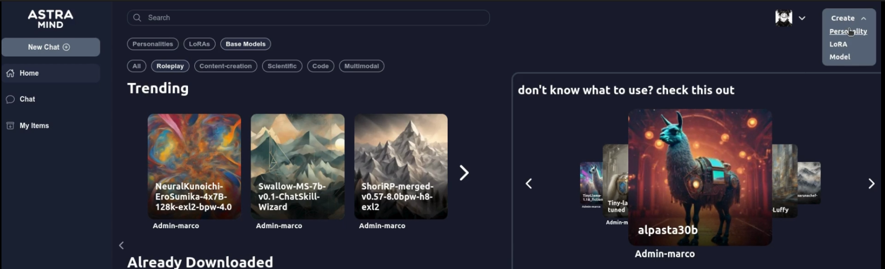
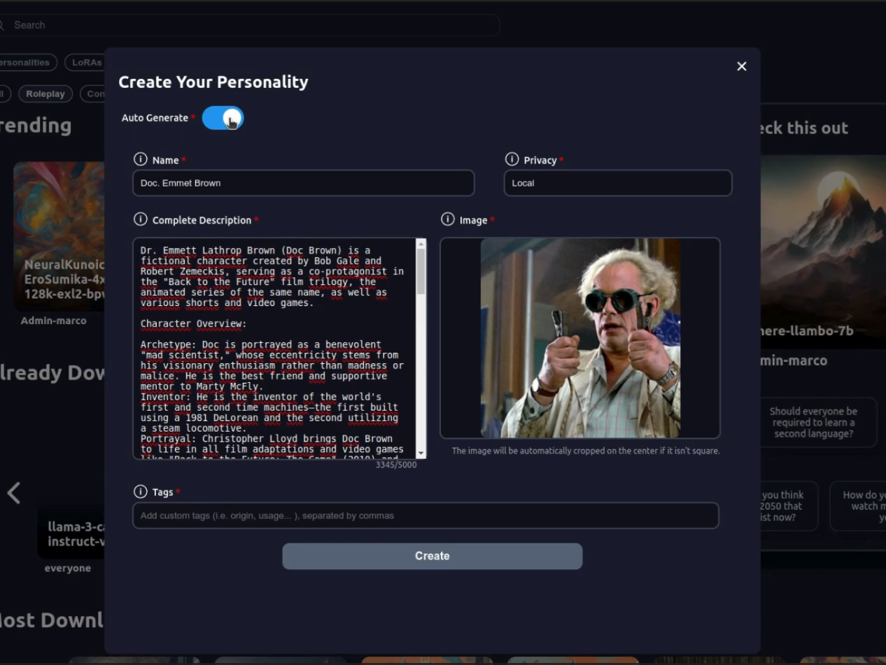
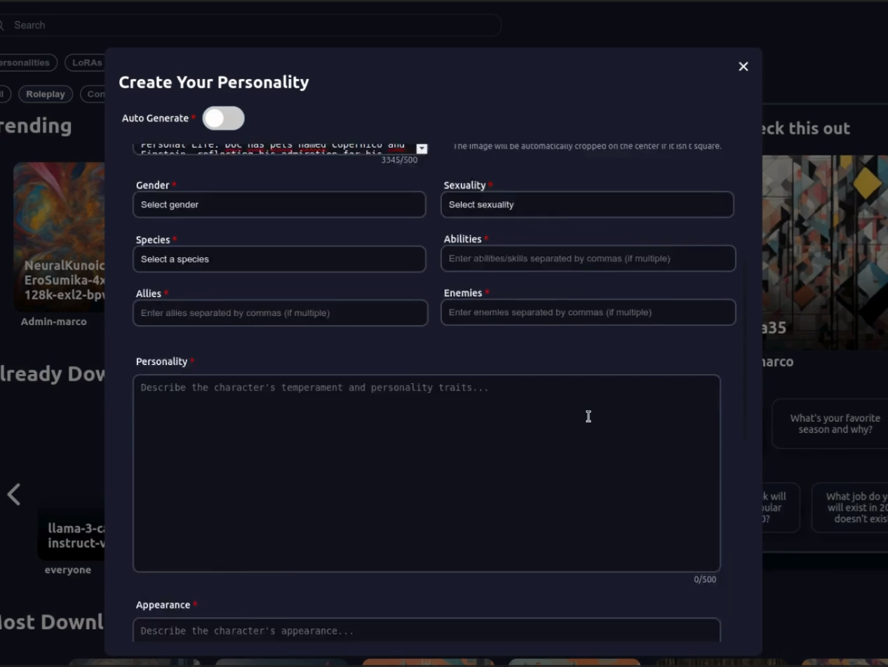
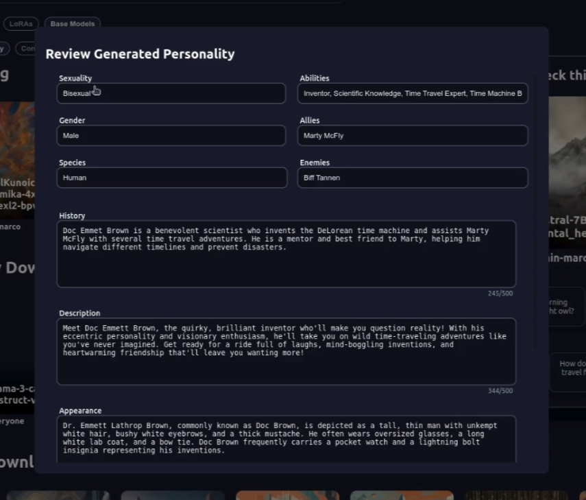
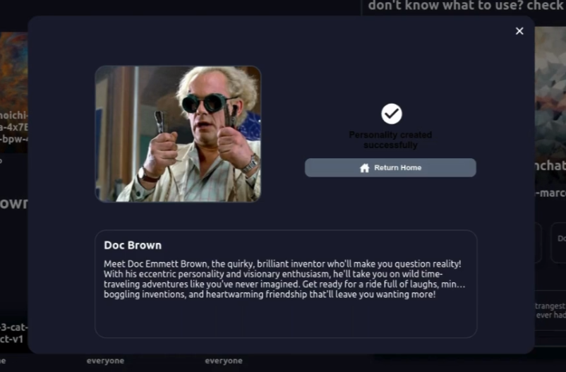

# Choose or Create a Personality

*This guide provides a step-by-step process to help you create or select a model personality. By following these steps, you'll be able to customize a personality that fits your needs.*

## Table of Contents

1. [Step 1: Select or Create a Personality Item](#step-1-select-or-create-a-personality-item)
2. [Step 2: Fill in the Fields](#step-2-fill-in-the-fields)
3. [Step 3: Review the Generation](#step-3-review-the-generation)
4. [Step 4: Finalize Your Personality](#step-4-finalize-your-personality)
5. [Conclusion](#conclusion)

---

## Step 1: Select or Create a Personality Item

Begin by selecting an existing personality item or creating a new one.

## Step 2: Fill in the Fields

Complete the necessary fields: **Name**, **Image**, **Description**, and **Privacy**.

### Privacy Settings

- **Online Public**: Your personality will be visible to everyone online. Anyone can find, access, and use it.
- **Online Private**: Your personality will only be visible to users who share the same server.
- **Local**: Your personality is only available to you. It is stored locally and will not be accessible by anyone else.

### Enable Auto-Generation

Automatically generate a complete description and characteristics for your personality. If you prefer to set these manually, you can deselect this option and fill in the details yourself.

### Manually Fill Fields

If you choose to manually enter the details, ensure all fields are accurately completed.

### Click on Generate

After filling in the fields, click the **Generate** button to create your personality.

## Step 3: Review the Generation

Carefully review the generated description and characteristics to ensure they meet your requirements. Make any necessary adjustments.

## Step 4: Finalize Your Personality

You have successfully generated your new personality to use with your model.

## If you encounter any problems please let us know through:

- [Issues](https://github.com/astramind-ai/PulsarUIReleases/issues)
- [info](https://www.astramind.ai/contact)

---