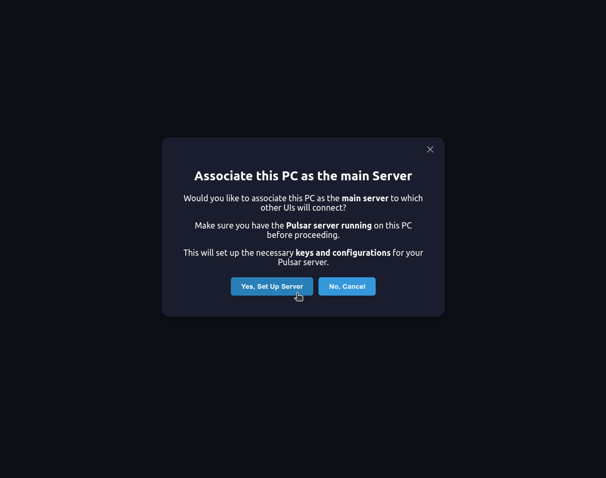
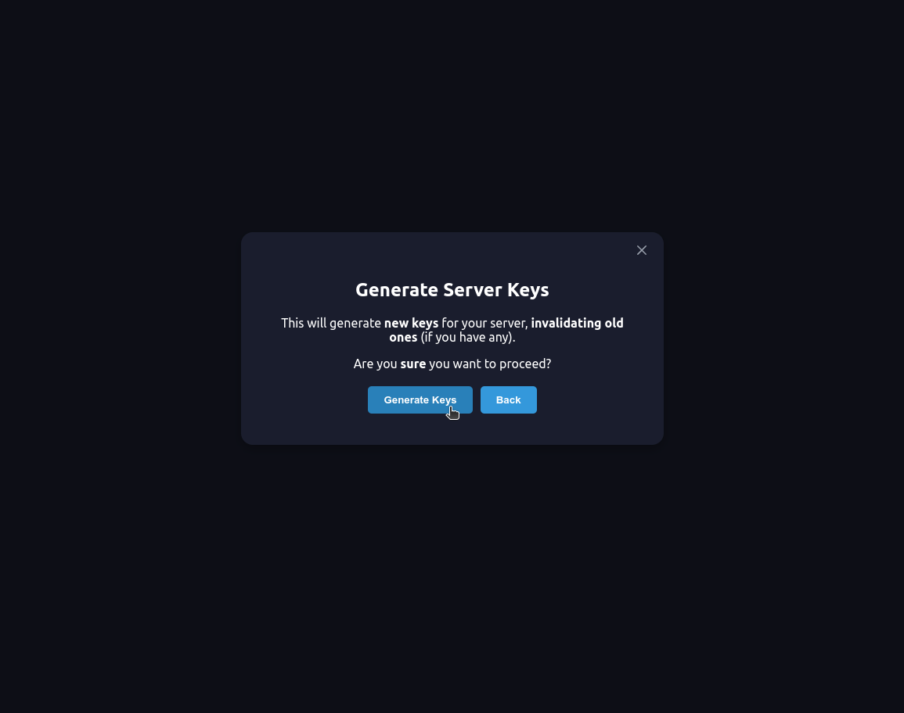

# Set Your Computer as a Server: Login and Create a New Account

## Table of Contents

1. [Step 1: Download and Start the Pulsar Server](#step-1-download-and-start-the-pulsar-server)
2. [Step 2: Download and Start the Pulsar UI](#step-2-download-and-start-the-pulsar-ui)
3. [Step 3: Verification Email (First Time)](#step-3-verification-email-first-time)
4. [Step 4: Create a User Account](#step-4-create-a-user-account)

---

## Registration and Login

Registration is necessary because it associates a pair of public and private keys. The machine designated as the server stores the private key and generates encrypted requests to our server, which, by verifying the signature, attests to the validity of the request and associates the new URL with the account. This process is completely free and avoids complicated DNS or DMZ configurations, allowing users to simply and freely use tunneling. Everything is designed to enable the user to connect securely with the local server.

**We do not keep any additional information about the user. User data is not our business!**

## Step 1: Download and Start the Pulsar Server

The first step is to download and install the Pulsar Server, then activate it. Refer to the installation guide for [Linux](https://github.com/astramind-ai/Pulsar/blob/main/docs/INSTALLATION-LINUX.md) or [Windows](https://github.com/astramind-ai/Pulsar/blob/main/docs/INSTALLATION-WINDOWS.md).

Once the server is running, download and install Pulsar UI and double-click on it.

**NOTE:** Make sure that the server is running correctly and shows a healthy status. It may take a few minutes. If it still does not work, try stopping and restarting the server. If the problem persists, open an [Issue](https://github.com/astramind-ai/PulsarUIReleases/issues) or contact us at [info](https://www.astramind.ai/contact).

## Step 2: Download and Start the Pulsar UI

### If You Intend to Make Your Computer a Server

**NOTE:** Ensure that the server is running correctly and displays a healthy status. This may take a few minutes. If it still does not work, try stopping and restarting the server. If the problem persists, open an [Issue](https://github.com/astramind-ai/PulsarUIReleases/issues) or contact us at [info](https://www.astramind.ai/contact).

## Login

If you already have an active server to connect to, enter your credentials, and you will be connected to the local server via tunneling.

## Create an Account

If this is your first time creating an account, after email verification, you will be asked if you want to use your computer as the server. Upon logging in, you should follow the steps to generate keys that will allow you to connect to your server remotely, processing all data locally on your PC.

## Step 3: Verification Email (First Time)

If this is your first time creating an account, a verification email will be sent to you.

### Step 4: Create a User Account

If everything went well, you should find yourself in the server's user home interface. At this point, create a new user and start using Pulsar.

**NOTE:** You can share your account with anyone you want. They will only need to download the Pulsar app, enter the credentials, and they can use your PC as a server by connecting securely through tunneling and creating their user account within the app.

## If You Encounter Any Problems, Please Let Us Know Through:

- [Issues](https://github.com/astramind-ai/PulsarUIReleases/issues)
- [Contact Us](https://www.astramind.ai/contact)

---
